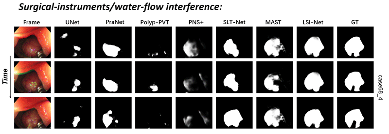

<div align="center">
<h2>LSI-Net</h2>
<h4>Long- and Short-term Temporal Interaction Network for Colonoscopy Video Polyp Segmentation</h4>


<p align="center">
     <br />
    <em> 
    Figure 1: Qualitative visualization of the proposed LSI-Net.  
    </em>
</p>

</div>
</div>

## Updates 

* `[2024-03-02]` We release the initial version of LSI-Net!


## Overview

Automatic polyp segmentation is a critical prerequisite for early clinical rectal cancer diagnosis. In colonoscopy videos, substantial background variations caused by moving cameras, along with internal artifacts(e.g.water flow in the human body and specular reflection by tissues) lead to significant variability in the quality of consecutive frames. To address the issue, previous methods have aimed to extract useful information from fixed frames(e.g.adjacent few frames, the first frame), but they often overlook richer hidden cues within intermediate predictions. In this paper, we propose a Multi-frame Information Cooperative Architecture(LSI-Net), which integrates both short-term and hidden long-term information from the whole interfere process. Locally, LSI-Net adaptively identifies intra-frame and inter-frame correlations from the two adjacent frames in a multiscale coarse-to-fine manner, that enhances the features with rich spatio-temporal relationships. Globally, LSI-Net fully explores long-term dependencies by utilizing the previously enhanced features and prediction masks, which are retrived and integrated from an elaborately designed memory-bank.


LSI-Net showcases formidable Learning Ability (`92.7/89.1` max Dice score on SUN-SEG-Easy/-Hard _Seen_) and Generalization Capabilities (`82.5/82.2` max Dice score on SUN-SEG-Easy/-Hard _Unseen_) in the VPS task, surpassing previous models by a large margin.

<p align="center">
     <br />
    <em> 
    Figure 2: Performance on challenging samples compared with other methods.  
    </em>
</p>
</div>
</div>

## Usage


### Preliminaries

- Python == 3.8
- [PyTorch == 1.9.0](https://pytorch.org/)
- NVIDIA GPU + [CUDA](https://developer.nvidia.com/cuda-downloads)


#### 1. Install dependencies for LSI-Net.


```bash
# Install dependent packages
pip install -r requirements.txt

# Install cuda extensions for PDFA
cd lib/ops_align
python setup.py build develop
cd ../..
```
Note:   
- More details about the cuda extensions for PDFA can be found in the work of [BasicSR](https://github.com/XPixelGroup/BasicSR)
      

#### 2. Prepare the datasets for LSI-Net.

Please refer to [PNS+](https://github.com/GewelsJI/VPS/blob/main/docs/DATA_DESCRIPTION.md) to get access to the SUN-SEG dataset, and download it to path `./datasets`. The path structure should be as follows:
```none
  LSI-Net
  ├── datasets
  │   ├── SUN-SEG
  │   │   ├── TestEasyDataset
  │   │   │   ├── Seen
  │   │   │   ├── Unseen
  │   │   ├── TestHardDataset
  │   │   │   ├── Seen
  │   │   │   ├── Unseen
  │   │   ├── TrainDataset
  │   │   │   ├── Classification
  │   │   │   ├── Detection
  │   │   │   ├── Edge
  │   │   │   ├── Frame
  │   │   │   ├── GT
  │   │   │   ├── Polygon
  │   │   │   ├── Scribble

  ```


#### 3. Prepare the pre-trained weights for the backbone.

The pretrained model of LSI-Net on the ??? dataset is available at [???](???)

```bash
mkdir pretrained
cd pretrained
# download the weights with the links below.
```


### Training

```bash
python train_video.py
```

### Testing

```bash
python test_video_mem.py
```

###  Evaluating 

Python: Please refer to the toolbox provided by [VPS](https://github.com/GewelsJI/VPS/tree/main/eval).

### Well trained model:
You could download the trained model from ??? and put the model in directory `./snapshot`.

### Pre-computed maps:
????
