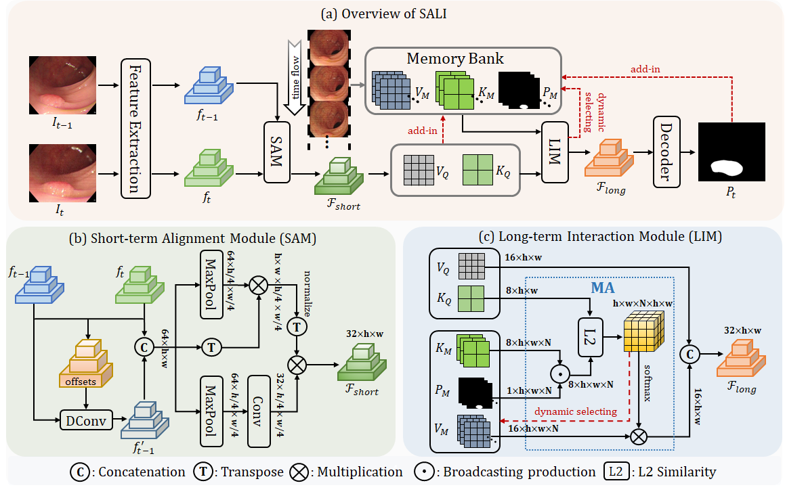
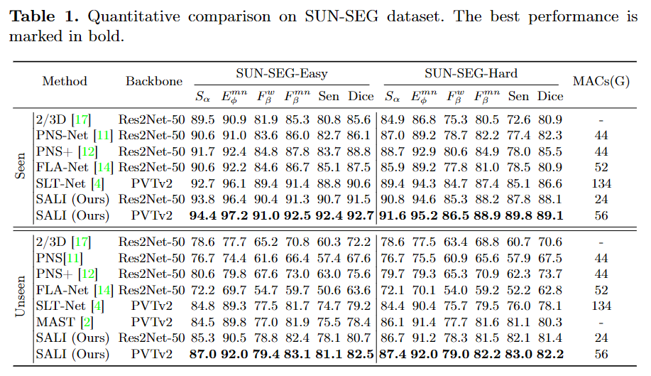

<div align="center">
<h1>SALI</h1>
<h3>Short-term Alignment and Long-term Interaction Network for Colonoscopy Video Polyp Segmentation</h3>
    
[](https://paperswithcode.com/sota/video-polyp-segmentation-on-sun-seg-easy?p=sali-short-term-alignment-and-long-term-1)
    
[](https://paperswithcode.com/sota/video-polyp-segmentation-on-sun-seg-hard?p=sali-short-term-alignment-and-long-term-1)

<p align="center">
     <br />
</p>
</div>
</div>

## Methods
<p align="center">
     <br />
</p>

Colonoscopy videos provide richer information in polyp segmentation for rectal cancer diagnosis.However, the endoscope's fast moving and close-up observing make the current methods suffer from large spatial incoherence and continuous low-quality frames, and thus yield limited segmentation accuracy. In this context, we focus on robust video polyp segmentation by enhancing the adjacent feature consistency and rebuilding the reliable polyp representation. To achieve this goal, we in this paper propose SALI network, a hybrid of Short-term Alignment Module (SAM) and Long-term Interaction Module (LIM).The SAM learns spatial-aligned features of adjacent frames via deformable convolution and further harmonizes them to capture more stable short-term polyp representation. In case of low-quality frames, the LIM stores the historical polyp representations as a long-term memory bank, and explores the retrospective relations to interactively rebuild more reliable polyp features for the current segmentation. Combing SAM and LIM, the SALI network of video segmentation shows a great robustness to the spatial variations and low-visual cues.

SALI showcases formidable Learning Ability (`92.7/89.1` max Dice score on SUN-SEG-Seen-Easy/-Hard) and Generalization Capabilities (`82.5/82.2` max Dice score on SUN-SEG-Unseen-Easy/-Hard) in the VPS task, surpassing previous models by a large margin.

## Experimental Results
### - Performance
<p align="center">
     <br />
</p>
</div>
</div>

<p align="center">
     <br />
</p>
</div>
</div>

### - Stability and reliability of the features
### - Stability
<p align="center">
     <br />
</p>
</div>
</div>

### - Realiability
<p align="center">
     <br />
</p>
</div>
</div>

- The figure below illustrates some of the  `Consecutive Low-quality Sequences` in the specific sub-test set.
<p align="center">
     <br />
</p>
</div>
</div>


## Usage
### - Preliminaries

- Python 3.8+
- PyTorch 1.9+ 
- TorchVision corresponding to the PyTorch version
- NVIDIA GPU + [CUDA](https://developer.nvidia.com/cuda-downloads)


#### 1. Install dependencies for SALI.


```bash
# Install other dependent packages
pip install -r requirements.txt

# Install cuda extensions for FA
cd lib/ops_align
python setup.py build develop
cd ../..
```


#### 2. Prepare the datasets for SALI.

Please refer to [PNS+](https://github.com/GewelsJI/VPS/blob/main/docs/DATA_DESCRIPTION.md) to get access to the SUN-SEG dataset, and download it to path `./datasets`. The path structure should be as follows:
```none
  SALI
  ├── datasets
  │   ├── SUN-SEG
  │   │   ├── TestEasyDataset
  │   │   │   ├── Seen
  │   │   │   ├── Unseen
  │   │   ├── TestHardDataset
  │   │   │   ├── Seen
  │   │   │   ├── Unseen
  │   │   ├── TrainDataset

  ```


#### 3. Prepare the pre-trained weights for the backbone.

The pre-trained weights is available [here](https://drive.google.com/file/d/1U77oKKK_qik2C0fd7hSKiYG43UA25GgD/view?usp=sharing).

```bash
mkdir pretrained
cd pretrained
# download the weights with the links above.
```


### - Training

```bash
python train_video.py
```


### - Testing

```bash
python test_video.py
```


### - Well trained model:
You can download our [checkpoint](https://drive.google.com/file/d/1sZvcWk2FFQo_6c6xFORLp-NjPwrptsAH/view?usp=sharing) and put it in directory `./snapshot` for a quick test.


### - Evaluating 

For fair comparison, we evaluate all methods through the toolbox `./eval` provided by [PNS+](https://github.com/GewelsJI/VPS/tree/main/eval).

### - Pre-computed maps:
The predition maps of SALI can be downloaded via this [link](https://drive.google.com/file/d/1L1ZcSUZxTJqRPoMjUaRRFzXlXdmApSOx/view?usp=drive_link).

## Citation
If you find our paper and code useful in your research, please consider giving us a star ⭐ and citing SALI by the following BibTeX entry.

```bash
@article{hu2024salishorttermalignmentlongterm,
  title        =       {SALI: Short-term Alignment and Long-term Interaction Network for Colonoscopy Video Polyp Segmentation}, 
  author       =       {Qiang Hu and Zhenyu Yi and Ying Zhou and Fang Peng and Mei Liu and Qiang Li and Zhiwei Wang},
  journal      =       {arXiv preprint arXiv:2406.13532},
  year         =       {2024},
}
```
